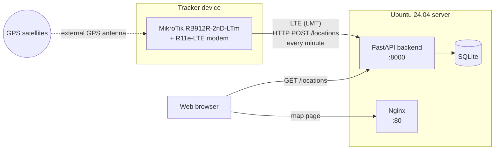

  

<h1 align="center">This is project Ares</h1>

Ares is a GPS tracking system. A MikroTik router with LTE and GPS reports its
position to a small Python backend, which stores the coordinates in SQLite and
shows them on a web map.

Architecture
------------

### Tracker device

| Part | Role |
| --- | --- |
| MikroTik RB912R-2nD-LTm (RouterOS) | Router: reads the GPS position and runs the upload script |
| MikroTik R11e-LTE (miniPCIe) | LTE modem, the device's only uplink to the internet |
| External GPS antenna | Gives a position fix (`gps-antenna-select=external`) |
| External LTE antennas | Improve the mobile signal |

The router has no wired uplink. Its default route goes out through `lte1` on
the LMT network (APN `internet.lmt.lv`), and NAT masquerades local clients
behind the LTE address. The GPS receiver is on `serial0`, so the RouterOS
serial console is turned off to free the port.

A RouterOS script, `send-gps-location`, runs every minute. It reads the latitude
and longitude from `/system gps` and sends them as JSON to the backend with
`/tool fetch`. It skips sending when there is no fix (the position reads 0/0).

### Server

- **Backend**: a Python FastAPI app. `POST /locations` stores a point with a
  UTC timestamp in SQLite, and `GET /locations` returns the newest points first.
- **Web**: a single HTML page with a Leaflet map on OpenStreetMap tiles. It shows
  the latest positions as markers with a clickable history list and refreshes
  every 30 seconds.
- **Deployment**: an Ansible playbook sets up Nginx and a systemd service on
  Ubuntu 24.04.

Repository
----------

- [`mikrotik/`](mikrotik/READM.md) has the router setup: LTE, NAT and GPS
- [`poc/`](poc/README.md) is the proof of concept: backend API, map page and
  Ansible deployment
